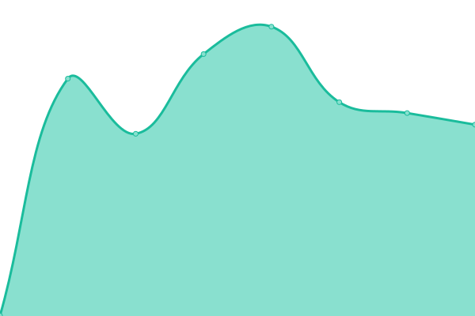
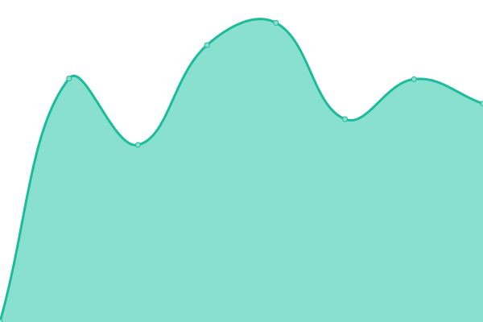

# [📈 Live Status](https://exand.github.io/upptime): <!--live status--> **🟩 All systems operational**

This repository contains the open-source uptime monitor and status page for [exand](https://exand.github.io/upptime), powered by [Upptime](https://github.com/upptime/upptime).

With [Upptime](https://upptime.js.org), you can get your own unlimited and free uptime monitor and status page, powered entirely by a GitHub repository. We use [Issues](https://github.com/exand/upptime/issues) as incident reports, [Actions](https://github.com/exand/upptime/actions) as uptime monitors, and [Pages](https://exand.github.io/upptime) for the status page.

<!--start: status pages-->
<!-- This summary is generated by Upptime (https://github.com/upptime/upptime) -->
<!-- Do not edit this manually, your changes will be overwritten -->
<!-- prettier-ignore -->
| URL | Status | History | Response Time | Uptime |
| --- | ------ | ------- | ------------- | ------ |
|  [Google](https://www.google.com) | 🟩 Up | [google.yml](https://github.com/exand/upptime/commits/HEAD/history/google.yml) | 

 72ms
     
 | 

<a href="https://exand.github.io/upptime/history/google">100.00%</a>
    

|  [Github Portfolio](https://exand.github.io/portfolio) | 🟩 Up | [github-portfolio.yml](https://github.com/exand/upptime/commits/HEAD/history/github-portfolio.yml) | 

 76ms
     
 | 

<a href="https://exand.github.io/upptime/history/github-portfolio">100.00%</a>
    

|  My Site | 🟩 Up | [my-site.yml](https://github.com/exand/upptime/commits/HEAD/history/my-site.yml) | 

 646ms
     
 | 

<a href="https://exand.github.io/upptime/history/my-site">100.00%</a>
    

|  Portfolio | 🟩 Up | [portfolio.yml](https://github.com/exand/upptime/commits/HEAD/history/portfolio.yml) | 

 601ms
     
 | 

<a href="https://exand.github.io/upptime/history/portfolio">100.00%</a>
    

|  Styleguide | 🟩 Up | [styleguide.yml](https://github.com/exand/upptime/commits/HEAD/history/styleguide.yml) | 

 674ms
     
 | 

<a href="https://exand.github.io/upptime/history/styleguide">100.00%</a>
    

<!--end: status pages-->

[**Visit our status website →**](https://exand.github.io/upptime)

## 📄 License

- Powered by: [Upptime](https://github.com/upptime/upptime)
- Code: [MIT](./LICENSE) © [exand](https://exand.github.io/upptime)
- Data in the `./history` directory: [Open Database License](https://opendatacommons.org/licenses/odbl/1-0/)
